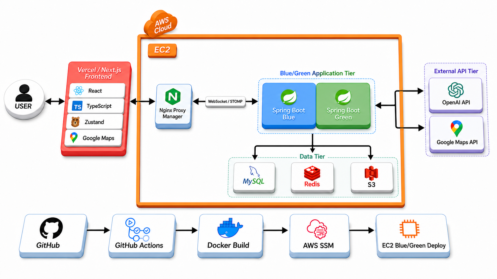
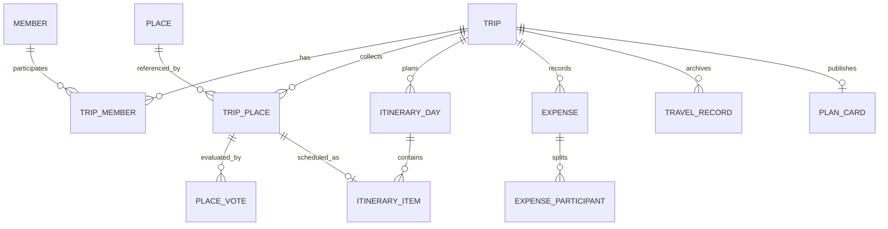
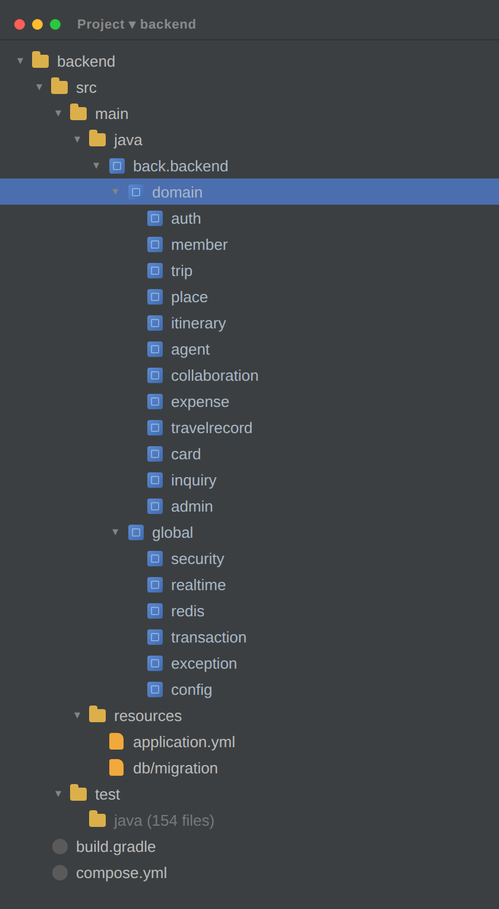
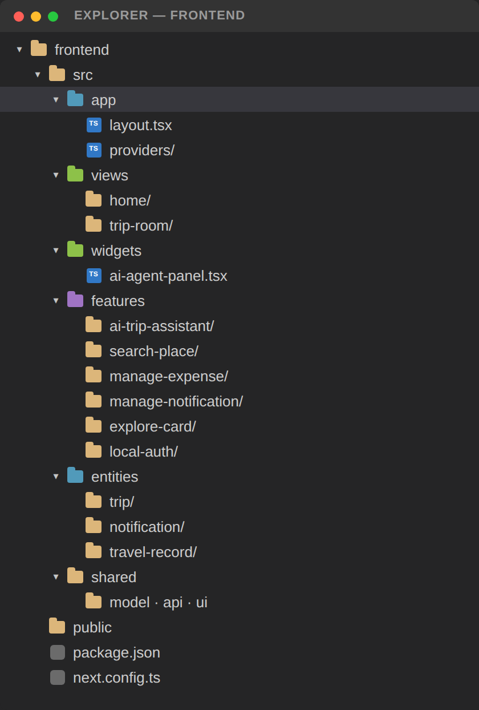

<a id="readme-top"></a>


<div align="center">
  

  <p>
    
  </p>

  <p>
    장소 탐색부터 투표, 날짜 조율, Day별 동선, 정산과 여행 기록까지<br/>
    함께 만드는 여행의 전 과정을 하나의 흐름으로 연결합니다.
  </p>

  <p>
    <a href="https://github.com/prgrms-aibe-devcourse/AIBE6_FinalProject_Team01/graphs/contributors"></a>
    <a href="https://github.com/prgrms-aibe-devcourse/AIBE6_FinalProject_Team01/issues"></a>
    
  </p>

  <p>
    <b>2026.07 — 2026.08</b> · Backend & Frontend 3인 팀 프로젝트
  </p>

  <p>
    <a href="https://www.plamingo.site/"></a>
    <a href="#-핵심-기능"></a>
    <a href="https://github.com/prgrms-aibe-devcourse/AIBE6_FinalProject_Team01/issues/new"></a>
  </p>
</div>

---

## 목차

- [프로젝트 소개](#-프로젝트-소개)
- [핵심 기능](#-핵심-기능)
- [시스템 아키텍처](#-시스템-아키텍처)
- [도메인 구조](#-도메인-구조)
- [기술적 도전과 개선](#-기술적-도전과-개선)
- [기술 스택](#-기술-스택)
- [프로젝트 구조](#-프로젝트-구조)
- [시작하기](#-시작하기)
- [테스트와 모니터링](#-테스트와-모니터링)
- [API 문서](#-api-문서)
- [팀원](#-팀원)

## 🦩 프로젝트 소개

> 여행 멤버들이 공유한 장소를 한곳에 모으고, 투표와 날짜 조율로 의견을 좁힌 뒤, 관계·거리·다양성을 고려한 Day별 일정으로 완성하는 공동 여행지도 서비스입니다.

여행을 준비할 때 장소는 SNS와 지도 앱에서 찾고, 의견은 메신저에서 나누며, 일정은 다시 메모나 스프레드시트로 정리합니다. 정보가 여러 플랫폼에 흩어지면서 결정 과정은 길어지고, 정리 부담은 특정 구성원에게 집중됩니다.

**Plamingo**는 이 단절을 하나의 사용자 흐름으로 연결합니다.

```text
장소 탐색·공유 → 분류·투표 → 날짜 조율 → Day 배치·동선 생성 → 경비 정산 → 여행 기록
```

### 우리가 해결하는 문제

| 기존 여행 준비                        | Plamingo                                       |
| ------------------------------------- | ---------------------------------------------- |
| 검색·메신저·메모·지도 앱을 반복 이동  | 장소와 의견, 일정을 여행방 한곳에 축적         |
| 말이 많은 사람이 결정을 주도          | 투표와 가능한 날짜를 근거로 공동 결정          |
| 장소만 모이고 실제 동선은 수작업      | 관계·거리·다양성을 반영해 Day와 방문 순서 구성 |
| 여행이 끝나면 사진과 비용 맥락이 분리 | 일정 Day 기준으로 기록과 경비를 함께 보관      |

### 서비스 이용 흐름

| 단계    | 사용자 경험                                 | 구현 기능                                                                   |
| ------- | ------------------------------------------- | --------------------------------------------------------------------------- |
| 1. 시작 | 계정을 만들고 여행방을 개설                 | 이메일 인증, Google·Kakao OAuth2, 여행 스타일·동행 유형·커버 이미지 설정    |
| 2. 초대 | 함께 갈 멤버를 여행방에 초대                | 초대 코드, 이메일 초대, 비회원 게스트 미리보기, 가입 후 초대 권한 연결      |
| 3. 결정 | 가능한 날짜와 후보 장소에 의견을 모음       | 멤버별 가능일 달력, 여행 기간 제안·과반 확정, 장소 찬반·A/B 투표, 댓글      |
| 4. 계획 | 확정 장소를 Day별 일정과 실제 동선으로 구성 | 자동 분류, 드래그 앤 드롭, 칸반·타임테이블, Routes 이동시간, AI 추천·재계획 |
| 5. 여행 | 현장에서 일정과 비용, 기록을 함께 갱신      | 접속 현황, 실시간 동기화, 지출 분담·정산 완료, Day별 사진·메모              |
| 6. 공유 | 여행을 회고하고 다른 여행자와 경험을 나눔   | 개인 회고, 공개 범위 설정, 여행 카드 탐색·댓글·북마크·일정 복사             |

<p align="right">(<a href="#readme-top">맨 위로</a>)</p>

## ✨ 핵심 기능

<table>
  <tr>
    <td width="50%" valign="top">
      <h3>📍 장소 검색과 자동 분류</h3>
      <p align="center"></p>
      
      <p>Google Places로 장소를 검색하고 저장합니다. 장소 유형과 이름 규칙을 조합해 여행방 카테고리로 분류하고, 지도 핀과 댓글로 세부 정보를 함께 남깁니다.</p>
    </td>
    <td width="50%" valign="top">
      <h3>🗳️ 투표와 날짜 조율</h3>
      <p align="center"></p>
      
      <p>단일 장소 찬반 투표와 두 장소 A/B 투표를 지원합니다. 멤버별 가능한 날짜도 모아 모두가 참여할 수 있는 여행 기간을 결정합니다.</p>
    </td>
  </tr>
  <tr>
    <td width="50%" valign="top">
      <h3>🧭 Day 배치와 동선 생성</h3>
      <p align="center"></p>
      
      <p>장소 관계도, 거리, 카테고리 다양성, 일정 과밀도를 반영해 장소를 Day별로 배치합니다. Google Routes의 실제 이동 정보를 이용해 방문 순서를 구체화합니다.</p>
    </td>
    <td width="50%" valign="top">
      <h3>💰 정산과 여행 기록</h3>
      <p align="center"></p>
      
      <p>지출 참여자를 기준으로 분담 금액과 정산 상태를 계산합니다. 여행 후에는 Day별 사진, 메모와 회고를 남겨 여행의 맥락을 보존합니다.</p>
    </td>
  </tr>
</table>

### 구현 기능 한눈에 보기

| 영역         | 주요 기능                                                                                  |
| ------------ | ------------------------------------------------------------------------------------------ |
| 여행방       | 생성·수정·삭제·나가기, 여행 상태 관리, 커버 이미지·프리셋, 공개 범위와 완료 확인           |
| 멤버 협업    | 초대 코드·이메일 초대·게스트 접근, 역할별 권한, 접속 위치·작업 영역 공유, 활동 로그와 알림 |
| 날짜 결정    | 멤버별 가능한 날짜 저장, 겹치는 날짜 확인, 여행 기간 제안, 찬반 투표와 과반수 자동 확정    |
| 장소 관리    | Google Places 검색·상세·사진, 카테고리 자동 분류, 지도 핀·장소 댓글, 찬반·A/B 투표         |
| 일정·동선    | Day 초기화, 일정 추가·수정·삭제·이동·정렬, 출발지·시간·이동수단 설정, 경로 미리보기·적용   |
| AI 지원      | 여행 조건 기반 장소 후보 추천, 전체 또는 특정 Day 재계획, OpenAI 장애 시 규칙 기반 폴백    |
| 여행 중·이후 | 동일 분담·직접 분담 지출, 참여자별 정산 상태, 사진 업로드, Day별 기록과 개인 회고          |
| 여행 탐색    | 공개 일정·기록 검색, 최신·인기·댓글순 정렬, 스타일 필터, 댓글·북마크·여행방 공유·일정 복사 |
| 계정·보안    | 이메일 가입·비밀번호 재설정, OAuth2, JWT 재발급·로그아웃, 프로필, 로그인 제한, 회원 탈퇴   |
| 관리자·문의  | 운영 대시보드, 회원 정지·부관리자 관리, 문의 답변, 외부 API 사용량, 커버 프리셋, 감사 로그 |

<p align="right">(<a href="#readme-top">맨 위로</a>)</p>

## 🏗 시스템 아키텍처

<p align="center">
  
</p>

### 데이터 흐름

1. Vercel의 Next.js 클라이언트가 REST API와 STOMP WebSocket으로 AWS의 Spring Boot 애플리케이션에 접근합니다.
2. Nginx Proxy Manager는 헬스체크를 통과한 Blue·Green 슬롯으로 트래픽을 전달하고, GitHub Actions와 AWS SSM이 배포 전환을 자동화합니다.
3. MySQL은 여행방·일정·정산·기록 같은 영속 데이터를, Redis는 Refresh Token·OTP·로그인 제한·외부 API 호출량 같은 만료성 상태를 관리합니다.
4. 사진은 Amazon S3에 저장하며 Google Places·Routes, OpenAI, Brevo 연동은 타임아웃·폴백·사용량 추적을 거쳐 호출합니다.
5. 도메인 변경이 커밋된 후 STOMP 이벤트를 발행해 같은 여행방 화면과 사용자별 알림을 갱신합니다.
6. Actuator와 k6 지표는 Prometheus에, 애플리케이션·Access Log는 Alloy를 거쳐 Loki에 수집되며 Grafana에서 같은 시간축으로 분석합니다.

> [!IMPORTANT]
> 현재 저장소에는 **Prometheus + Grafana + Loki + Alloy** 기반의 로컬 부하테스트 관제 환경이 구현되어 있습니다. 운영환경에 적용할 때는 인증·TLS·영구 스토리지와 별도의 로그 보존 정책이 필요합니다.

<p align="right">(<a href="#readme-top">맨 위로</a>)</p>

## 🗂 도메인 구조



- **인증·회원 (`auth`, `member`)**: 이메일·OAuth2 로그인, JWT 수명주기, 프로필, 계정 상태와 개인정보 파기
- **여행방 (`trip`)**: 여행 생성부터 멤버·게스트 초대, 날짜 조율, 상태·공개 범위·완료 처리까지 관리하는 중심 도메인
- **장소 (`place`)**: Places 검색, 여행방 장소·카테고리·지도 핀, 댓글, 투표와 장소 관계 점수 관리
- **일정 (`itinerary`)**: Day와 일정 항목, 이동수단·시간, 순서 변경, 경로 계산과 배치 알고리즘 관리
- **AI 지원 (`agent`)**: 장소 추천과 일정 재계획을 미리보기로 제공하고 사용자가 승인한 결과만 반영
- **협업 (`collaboration`)**: 도메인 변경을 활동 로그·알림으로 남기고 STOMP 이벤트로 실시간 전달
- **정산·기록 (`expense`, `travelrecord`)**: 지출 참여자별 분담·완료 상태와 Day별 사진·메모·개인 회고 관리
- **공개 카드 (`card`)**: 완료된 여행의 공개·검색·댓글·북마크·공유와 다른 여행방으로 일정 복사
- **운영 (`admin`, `inquiry`)**: 회원·문의·외부 API 사용량·커버 이미지 관리와 모든 관리자 조치 감사 기록

<p align="right">(<a href="#readme-top">맨 위로</a>)</p>

## 🧩 기술적 도전과 개선

### 1. 설명 가능한 Day 배치 알고리즘

단순 거리순 정렬은 같은 유형의 장소가 한 Day에 몰리거나 일정이 과밀해지는 문제를 만들었습니다. 이를 해결하기 위해 장소 관계 점수와 실제 배치 점수를 분리했습니다.

```text
장소 관계 점수 = 여행 스타일 유사도 + 공동 방문 이력
Day 배치 점수 = 관계도 + 거리 + 카테고리 다양성 + 일정 밀집도
방문 순서     = 최근접 이웃 + 영업·식사·이동시간 제약
```

생성형 AI가 전체 일정을 결정하지 않고, 서버의 제약 기반 알고리즘이 재현 가능한 일정을 만든 뒤 AI가 추천과 재계획을 보조하도록 역할을 구분했습니다.

### 2. Google Maps 정책을 준수한 호출 구조 최적화

Places 콘텐츠를 임의로 장기 보관하는 대신, 불필요한 요청 자체를 줄이는 방향으로 설계했습니다.

- 장소 검색 입력 `700ms` debounce와 이전 요청 취소·응답 순서 검증
- 여행지 자동완성에 Autocomplete Session Token 적용
- 일정 변경 시 전체가 아닌 영향받은 연결 구간만 Routes API 재계산
- 이동수단별 Field Mask 최소화
- Redis 기반 분당 호출량 제한과 외부 API 사용량 기록

### 3. AI 장애를 서비스 장애로 전파하지 않기

OpenAI 키가 없거나 응답이 실패해도 규칙 기반 `ItineraryRoutePlanner`로 대체합니다. 외부 AI는 추천 품질을 높이는 보조 수단이며, 핵심 일정 기능의 가용성을 결정하지 않습니다.

### 4. DB 상태와 실시간 화면의 일관성 유지

여행방 변경과 동시에 WebSocket 메시지를 보내면 트랜잭션 롤백 후에도 다른 사용자의 화면만 먼저 바뀔 수 있습니다. 활동 로그와 알림은 도메인 변경 트랜잭션에 함께 저장하고, 실시간 이벤트는 `AFTER_COMMIT` 단계에서만 전달하도록 분리했습니다.

- 여행방·공개 카드 단위 topic과 사용자별 notification queue 분리
- 여행방 멤버 여부를 확인한 뒤 접속 위치와 현재 작업 영역 공유
- 계정 정지 시 기존 WebSocket 사용자 세션도 즉시 무효화
- 끊어진 연결은 프론트엔드에서 재연결하고 서버 상태를 다시 조회해 동기화

### 5. 인증부터 관리자 작업까지 이어지는 보안 경계

일반 사용자와 관리자 인증을 같은 로그인 성공 여부로만 구분하지 않고 계정 상태와 작업 위험도에 따라 검증 단계를 나눴습니다.

- Access Token과 Redis Refresh Token 회전으로 탈취 토큰 재사용 방지
- 이메일·IP 단위 로그인 시도 제한과 이메일 인증·비밀번호 재설정
- Google·Kakao OAuth2 로그인과 암호화 키 설정 시 제공자 토큰 암호화 저장
- 관리자 로그인 및 부관리자 중요 작업에 6자리 OTP 추가 인증
- 쿠키 기반 요청의 Origin 검증, 서버 권한 확인, 계정 정지·탈퇴 후 개인정보 파기

### 6. k6 기반 부하 테스트와 실시간 병목 관찰

`performance/`에 Smoke, Load, Spike, Stress, Soak, WebSocket 및 실제 사용자 흐름 시나리오를 구성했습니다.

- `dashboard`, `trip_room`, `write` flow와 endpoint 태그로 느린 API를 단계적으로 추적
- 최대 1,000 VU까지 증가시키며 p95/p99, 실패율과 WebSocket 연결시간 측정
- HikariCP active/pending, Tomcat thread, CPU, GC 지표를 같은 시간축으로 비교
- 애플리케이션·Access Log를 Alloy로 수집하고 Loki에서 API 오류와 병목 시점 추적
- Access Log에서는 쿼리 문자열을 제외해 토큰·검색어 등 민감정보 노출 방지
- `performance` 프로필에서는 Google Maps·OpenAI·Brevo·S3 호출을 차단해 테스트 과금 방지

<details>
<summary><b>1,000 VU 로컬 테스트 요약 보기</b></summary>

| 항목        |      결과 |
| ----------- | --------: |
| 최대 VU     |     1,000 |
| HTTP 요청   | 552,038건 |
| 전체 p95    |   78.85ms |
| HTTP 실패율 |     0.06% |
| 서버 5xx    |       0건 |

> 로컬 단일 장비에서 부하 발생기·서버·DB·모니터링을 함께 실행한 결과이므로 정확한 서버 한계치는 부하 발생기를 분리한 배포 환경에서 재검증해야 합니다.

</details>

### 7. Blue/Green 무중단 배포

`dev` 브랜치 변경을 기준으로 GitHub Actions가 Docker 이미지를 GHCR에 게시하고 AWS SSM으로 EC2 배포를 수행합니다. 비활성 슬롯의 헬스체크가 통과한 뒤 트래픽을 전환하고 기존 슬롯을 종료해 다운타임과 실패 배포 위험을 줄입니다.

<p align="right">(<a href="#readme-top">맨 위로</a>)</p>

## 🧰 기술 스택

<p align="center">
  
</p>

<p align="center"><sub>아래 표에서 실제 적용 버전과 관제·외부 연동 기술을 확인할 수 있습니다.</sub></p>

| 영역               | 기술                                                                                                                                                                                                                                                                                                                                                                                                                                                                                                                                                                                                                                                                                                                                                                                                                                                                                                                                                                        |
| ------------------ | --------------------------------------------------------------------------------------------------------------------------------------------------------------------------------------------------------------------------------------------------------------------------------------------------------------------------------------------------------------------------------------------------------------------------------------------------------------------------------------------------------------------------------------------------------------------------------------------------------------------------------------------------------------------------------------------------------------------------------------------------------------------------------------------------------------------------------------------------------------------------------------------------------------------------------------------------------------------------- |
| Frontend           |                                                                                                                                                                                                                                                                                                                                                                                                                                                  |
| Backend            |                                                                                                                                                                                                                                                                                                                                                                                                                                                        |
| Data & Storage     |                                                                                                                                                                                                                                                                                                                                                                                                                                                                                                                                                              |
| External API       |                                                                                                                                                                                                                                                                                                                                                                                                                                                                                                                                                                                                                                                                    |
| Infra & Monitoring |          |

<p align="right">(<a href="#readme-top">맨 위로</a>)</p>

## 📁 프로젝트 구조

백엔드는 IntelliJ IDEA, 프론트엔드는 VS Code로 개발한 실제 작업 환경 그대로 구조를 정리했습니다.

<table>
  <tr>
    <td align="center" width="50%">
      <sub><b>Backend · IntelliJ IDEA</b></sub><br/><br/>
      
    </td>
    <td align="center" width="50%">
      <sub><b>Frontend · VS Code</b></sub><br/><br/>
      
    </td>
  </tr>
</table>

<p align="right">(<a href="#readme-top">맨 위로</a>)</p>

## 🚀 시작하기

### 요구사항

- Java 21
- Node.js 20.9 이상
- Docker 및 Docker Compose

### 1. 저장소 복제

```bash
git clone https://github.com/prgrms-aibe-devcourse/AIBE6_FinalProject_Team01.git
cd AIBE6_FinalProject_Team01
```

### 2. 백엔드 환경변수 설정

`backend/.env`에 로컬 인프라와 애플리케이션 환경변수를 설정합니다. 실제 비밀값은 커밋하지 않습니다.

```env
MYSQL_USER=
MYSQL_PASSWORD=
MYSQL_ROOT_PASSWORD=
REDIS_PASSWORD=
JWT_SECRET=
GRAFANA_ADMIN_PASSWORD=

# 선택 연동
GOOGLE_MAPS_API_KEY=
OPENAI_API_KEY=
GOOGLE_CLIENT_ID=
GOOGLE_CLIENT_SECRET=
KAKAO_CLIENT_ID=
KAKAO_CLIENT_SECRET=
BREVO_SMTP_USERNAME=
BREVO_SMTP_PASSWORD=
```

> 정확한 변수명과 선택 설정은 `backend/src/main/resources/application-*.yml` 및 기존 환경 설정 문서를 확인해주세요.

### 3. 인프라와 백엔드 실행

```bash
cd backend
docker compose up -d
./gradlew bootRun                  # macOS / Linux
# gradlew.bat bootRun              # Windows
```

기본 로컬 프로필은 OAuth 키 없이 실행할 수 있습니다. 소셜 로그인이 필요하면 OAuth 환경변수를 설정하고 프로필을 추가합니다.

```bash
./gradlew bootRun --args='--spring.profiles.active=local,oauth'
```

### 4. 프론트엔드 실행

```bash
cd ../frontend
npm install
npm run dev
```

| 서비스     | 주소                                  |
| ---------- | ------------------------------------- |
| Frontend   | http://localhost:3000                 |
| Backend    | http://localhost:8080                 |
| Swagger UI | http://localhost:8080/swagger-ui.html |
| Prometheus | http://localhost:9090                 |
| Grafana    | http://localhost:3001                 |

> [!CAUTION]
> `docker compose down -v`는 MySQL·Redis·모니터링 볼륨을 삭제합니다. 데이터 초기화가 필요한 경우에만 사용하세요.

<p align="right">(<a href="#readme-top">맨 위로</a>)</p>

## 🧪 테스트와 모니터링

### 자동화 검증

```bash
# Backend
cd backend
./gradlew test
./gradlew clean build

# Frontend
cd ../frontend
npm run lint
npm run type-check
npm test
npm run build
```

- Backend: JUnit 5, AssertJ, Spring MVC/Security/JPA 통합 테스트 **800+**
- Frontend: Node Test Runner 기반 테스트 **77개**

### 로컬 성능 테스트

```bash
# 프로젝트 루트에서 모니터링 실행
./performance/start-monitoring.sh

# 백엔드는 과금 방지용 performance 프로필로 실행
cd backend
SPRING_PROFILES_ACTIVE=local,performance ./gradlew bootRun
```

자세한 k6 시나리오와 Grafana 사용법은 [`performance/README.md`](performance/README.md)를 참고하세요.

<p align="right">(<a href="#readme-top">맨 위로</a>)</p>

## 📖 API 문서

백엔드 실행 후 확인할 수 있습니다.

- Swagger UI: http://localhost:8080/swagger-ui.html
- OpenAPI JSON: http://localhost:8080/v3/api-docs
- Flyway 규칙: [`backend/src/main/resources/db/migration/README.md`](backend/src/main/resources/db/migration/README.md)

## 👥 팀원

|                        GitHub                        |      이름      | 주요 역할      |
| :--------------------------------------------------: | :------------: | -------------- |
|           [@0-0v](https://github.com/0-0v)           | 팀원 정보 입력 | 담당 기능 입력 |
|    [@HeungJunBag](https://github.com/HeungJunBag)    | 팀원 정보 입력 | 담당 기능 입력 |
| [@JuyoungKim1024](https://github.com/JuyoungKim1024) | 팀원 정보 입력 | 담당 기능 입력 |

> 팀원 이름과 역할은 발표 자료 및 실제 업무 분담표를 기준으로 최종 교체해주세요.

<p align="right">(<a href="#readme-top">맨 위로</a>)</p>

---

<div align="center">
  
  <br/>
  <b>여행의 시작부터 기록까지, 함께 완성하는 Plamingo</b>
</div>


