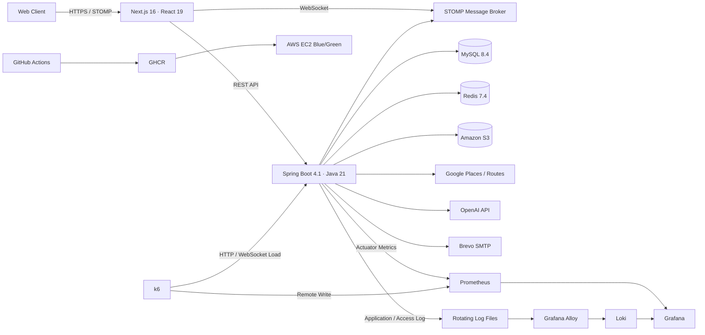
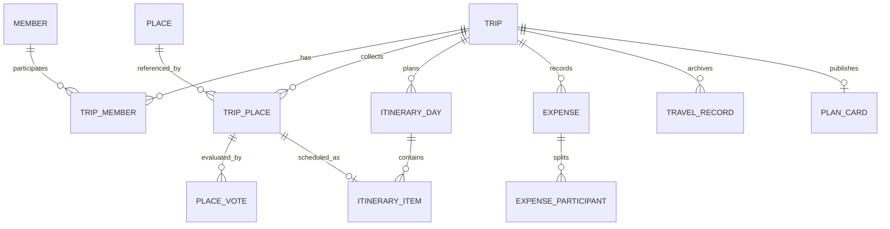

<a id="readme-top"></a>


<div align="center">
  

  <h3>사용자 맞춤형 여행 동선 최적화 및 공동 의사결정 플랫폼</h3>

  <p>
    장소 탐색부터 투표, 날짜 조율, Day별 동선, 정산과 여행 기록까지<br/>
    함께 만드는 여행의 전 과정을 하나의 흐름으로 연결합니다.
  </p>

  <p>
    <a href="https://github.com/prgrms-aibe-devcourse/AIBE6_FinalProject_Team01/graphs/contributors"></a>
    <a href="https://github.com/prgrms-aibe-devcourse/AIBE6_FinalProject_Team01/issues"></a>
    
    
    
    
  </p>

  <p>
    <b>2026.07 — 2026.08</b> · Backend & Frontend 3인 팀 프로젝트
  </p>

  <p>
    🚀 배포 링크 준비 중 ·
    <a href="https://github.com/prgrms-aibe-devcourse/AIBE6_FinalProject_Team01/issues/new">🐛 버그 리포트</a> ·
    🎬 데모 영상 준비 중
  </p>
</div>

---

## 목차

- [프로젝트 소개](#-프로젝트-소개)
- [핵심 기능](#-핵심-기능)
- [시스템 아키텍처](#-시스템-아키텍처)
- [도메인 구조](#-도메인-구조)
- [기술적 도전과 개선](#-기술적-도전과-개선)
- [기술 스택](#-기술-스택)
- [프로젝트 구조](#-프로젝트-구조)
- [시작하기](#-시작하기)
- [테스트와 모니터링](#-테스트와-모니터링)
- [API 문서](#-api-문서)
- [팀원](#-팀원)

## 🦩 프로젝트 소개

> 여행 멤버들이 공유한 장소를 한곳에 모으고, 투표와 날짜 조율로 의견을 좁힌 뒤, 관계·거리·다양성을 고려한 Day별 일정으로 완성하는 공동 여행지도 서비스입니다.

여행을 준비할 때 장소는 SNS와 지도 앱에서 찾고, 의견은 메신저에서 나누며, 일정은 다시 메모나 스프레드시트로 정리합니다. 정보가 여러 플랫폼에 흩어지면서 결정 과정은 길어지고, 정리 부담은 특정 구성원에게 집중됩니다.

**Plamingo**는 이 단절을 하나의 사용자 흐름으로 연결합니다.

```text
장소 탐색·공유 → 분류·투표 → 날짜 조율 → Day 배치·동선 생성 → 경비 정산 → 여행 기록
```

<p align="center">
  
</p>

### 우리가 해결하는 문제

| 기존 여행 준비                        | Plamingo                                       |
| ------------------------------------- | ---------------------------------------------- |
| 검색·메신저·메모·지도 앱을 반복 이동  | 장소와 의견, 일정을 여행방 한곳에 축적         |
| 말이 많은 사람이 결정을 주도          | 투표와 가능한 날짜를 근거로 공동 결정          |
| 장소만 모이고 실제 동선은 수작업      | 관계·거리·다양성을 반영해 Day와 방문 순서 구성 |
| 여행이 끝나면 사진과 비용 맥락이 분리 | 일정 Day 기준으로 기록과 경비를 함께 보관      |

<p align="right">(<a href="#readme-top">맨 위로</a>)</p>

## ✨ 핵심 기능

<table>
  <tr>
    <td width="50%" valign="top">
      <h3>📍 장소 검색과 자동 분류</h3>
      
      <p>Google Places로 장소를 검색하고 저장합니다. 장소 유형과 이름 규칙을 조합해 여행방 카테고리로 분류하고, 지도 핀과 댓글로 세부 정보를 함께 남깁니다.</p>
    </td>
    <td width="50%" valign="top">
      <h3>🗳️ 투표와 날짜 조율</h3>
      
      <p>단일 장소 찬반 투표와 두 장소 A/B 투표를 지원합니다. 멤버별 가능한 날짜도 모아 모두가 참여할 수 있는 여행 기간을 결정합니다.</p>
    </td>
  </tr>
  <tr>
    <td width="50%" valign="top">
      <h3>🧭 Day 배치와 동선 생성</h3>
      
      <p>장소 관계도, 거리, 카테고리 다양성, 일정 과밀도를 반영해 장소를 Day별로 배치합니다. Google Routes의 실제 이동 정보를 이용해 방문 순서를 구체화합니다.</p>
    </td>
    <td width="50%" valign="top">
      <h3>💰 정산과 여행 기록</h3>
      
      <p>지출 참여자를 기준으로 분담 금액과 정산 상태를 계산합니다. 여행 후에는 Day별 사진, 메모와 회고를 남겨 여행의 맥락을 보존합니다.</p>
    </td>
  </tr>
</table>

<details>
<summary><b>더 많은 기능 보기</b></summary>

- **실시간 협업**: STOMP WebSocket 이벤트, 여행방 접속 현황, 활동 로그와 알림
- **AI 보조 기능**: 장소 추천과 일정 재계획, 외부 AI 실패 시 규칙 기반 알고리즘 폴백
- **공개 여행 카드**: 완성된 여행 공개, 북마크, 내 여행방으로 복사
- **초대와 권한**: 이메일 초대, 게스트 미리보기, 여행방 역할별 접근 제어
- **인증과 운영**: JWT, Google/Kakao OAuth2, 이메일 인증, 관리자 OTP 및 감사 로그

</details>

<p align="right">(<a href="#readme-top">맨 위로</a>)</p>

## 🏗 시스템 아키텍처



### 데이터 흐름

1. 프론트엔드는 REST API로 여행방·장소·일정 데이터를 조회하고 변경합니다.
2. 변경이 커밋되면 STOMP 이벤트가 같은 여행방의 멤버에게 전달되어 화면을 갱신합니다.
3. MySQL은 핵심 도메인 데이터를, Redis는 인증과 호출량 제한 등 휘발성 상태를 관리합니다.
4. Google Places·Routes와 OpenAI 같은 외부 API는 타임아웃·폴백·사용량 추적을 거쳐 호출합니다.
5. Actuator와 k6 지표는 Prometheus에, 애플리케이션·Access Log는 Alloy를 거쳐 Loki에 수집되며 Grafana에서 같은 시간축으로 분석합니다.

> [!IMPORTANT]
> 현재 저장소에는 **Prometheus + Grafana + Loki + Alloy** 기반의 로컬 부하테스트 관제 환경이 구현되어 있습니다. 운영환경에 적용할 때는 인증·TLS·영구 스토리지와 별도의 로그 보존 정책이 필요합니다.

<p align="right">(<a href="#readme-top">맨 위로</a>)</p>

## 🗂 도메인 구조



- **여행방 협업 도메인**: 여행방 생성, 멤버·게스트 초대, 권한, 알림과 활동 로그의 기준이 되는 중심 도메인
- **장소·일정 도메인**: 장소 등록·분류·투표부터 Day 배치와 이동 구간 계산까지 여행 계획을 완성하는 핵심 흐름
- **AI 추천 도메인**: 저장된 장소와 일정 조건을 바탕으로 후보를 추천하고, 사용자 승인 후 일정에 반영하는 보조 계층
- **기록·정산 도메인**: 여행 Day의 사진과 회고, 참여자별 지출과 정산 상태를 여행 맥락에 연결

<p align="right">(<a href="#readme-top">맨 위로</a>)</p>

## 🧩 기술적 도전과 개선

### 1. 설명 가능한 Day 배치 알고리즘

단순 거리순 정렬은 같은 유형의 장소가 한 Day에 몰리거나 일정이 과밀해지는 문제를 만들었습니다. 이를 해결하기 위해 장소 관계 점수와 실제 배치 점수를 분리했습니다.

```text
장소 관계 점수 = 여행 스타일 유사도 + 공동 방문 이력
Day 배치 점수 = 관계도 + 거리 + 카테고리 다양성 + 일정 밀집도
방문 순서     = 최근접 이웃 + 영업·식사·이동시간 제약
```

생성형 AI가 전체 일정을 결정하지 않고, 서버의 제약 기반 알고리즘이 재현 가능한 일정을 만든 뒤 AI가 추천과 재계획을 보조하도록 역할을 구분했습니다.

### 2. Google Maps 정책을 준수한 호출 구조 최적화

Places 콘텐츠를 임의로 장기 보관하는 대신, 불필요한 요청 자체를 줄이는 방향으로 설계했습니다.

- 장소 검색 입력 `700ms` debounce와 이전 요청 취소·응답 순서 검증
- 여행지 자동완성에 Autocomplete Session Token 적용
- 일정 변경 시 전체가 아닌 영향받은 연결 구간만 Routes API 재계산
- 이동수단별 Field Mask 최소화
- Redis 기반 분당 호출량 제한과 외부 API 사용량 기록

### 3. AI 장애를 서비스 장애로 전파하지 않기

OpenAI 키가 없거나 응답이 실패해도 규칙 기반 `ItineraryRoutePlanner`로 대체합니다. 외부 AI는 추천 품질을 높이는 보조 수단이며, 핵심 일정 기능의 가용성을 결정하지 않습니다.

### 4. k6 기반 부하 테스트와 실시간 병목 관찰

`performance/`에 Smoke, Load, Spike, Stress, Soak, WebSocket 및 실제 사용자 흐름 시나리오를 구성했습니다.

- `dashboard`, `trip_room`, `write` flow와 endpoint 태그로 느린 API를 단계적으로 추적
- 최대 1,000 VU까지 증가시키며 p95/p99, 실패율과 WebSocket 연결시간 측정
- HikariCP active/pending, Tomcat thread, CPU, GC 지표를 같은 시간축으로 비교
- 애플리케이션·Access Log를 Alloy로 수집하고 Loki에서 API 오류와 병목 시점 추적
- Access Log에서는 쿼리 문자열을 제외해 토큰·검색어 등 민감정보 노출 방지
- `performance` 프로필에서는 Google Maps·OpenAI·Brevo·S3 호출을 차단해 테스트 과금 방지

<details>
<summary><b>1,000 VU 로컬 테스트 요약 보기</b></summary>

| 항목        |      결과 |
| ----------- | --------: |
| 최대 VU     |     1,000 |
| HTTP 요청   | 552,038건 |
| 전체 p95    |   78.85ms |
| HTTP 실패율 |     0.06% |
| 서버 5xx    |       0건 |

> 로컬 단일 장비에서 부하 발생기·서버·DB·모니터링을 함께 실행한 결과이므로 정확한 서버 한계치는 부하 발생기를 분리한 배포 환경에서 재검증해야 합니다.

</details>

### 5. Blue/Green 무중단 배포

`dev` 브랜치 변경을 기준으로 GitHub Actions가 Docker 이미지를 GHCR에 게시하고 AWS SSM으로 EC2 배포를 수행합니다. Green 슬롯의 헬스체크가 통과한 뒤 트래픽을 전환하고 기존 Blue 슬롯을 종료해 다운타임과 실패 배포 위험을 줄입니다.

<p align="right">(<a href="#readme-top">맨 위로</a>)</p>

## 🧰 기술 스택

| 영역               | 기술                                                                                                                                                                                                                                                                                                                                                                                                                                                                                                                                                                                                                                                                                                                                                                                                                                                                                                                                                                        |
| ------------------ | --------------------------------------------------------------------------------------------------------------------------------------------------------------------------------------------------------------------------------------------------------------------------------------------------------------------------------------------------------------------------------------------------------------------------------------------------------------------------------------------------------------------------------------------------------------------------------------------------------------------------------------------------------------------------------------------------------------------------------------------------------------------------------------------------------------------------------------------------------------------------------------------------------------------------------------------------------------------------- |
| Frontend           |                                                                                                                                                                                                                                                                                                                                                                                                                                                  |
| Backend            |                                                                                                                                                                                                                                                                                                                                                                                                                                                        |
| Data & Storage     |                                                                                                                                                                                                                                                                                                                                                                                                                                                                                                                                                              |
| External API       |                                                                                                                                                                                                                                                                                                                                                                                                                                                                                                                                                                                                                                                                    |
| Infra & Monitoring |          |

<p align="right">(<a href="#readme-top">맨 위로</a>)</p>

## 📁 프로젝트 구조

```text
.
├── frontend/                 # Next.js App Router + FSD
│   └── src/
│       ├── app/              # 라우팅과 전역 초기화
│       ├── views/            # URL 단위 화면 조합
│       ├── widgets/          # 독립 UI 블록
│       ├── features/         # 사용자 행동 단위 기능
│       ├── entities/         # 비즈니스 엔티티
│       └── shared/           # 공통 UI, 상태, API, 유틸
├── backend/                  # Spring Boot 4.1 · Java 21
│   └── src/main/java/back/backend/
│       ├── domain/           # trip, place, itinerary, expense, card, admin ...
│       └── global/           # security, realtime, redis, exception, config
├── performance/              # k6 · Prometheus · Grafana · Loki · Alloy
├── infra/                    # AWS Terraform
└── .github/workflows/        # CI/CD Blue/Green 배포
```

<p align="right">(<a href="#readme-top">맨 위로</a>)</p>

## 🚀 시작하기

### 요구사항

- Java 21
- Node.js 20.9 이상
- Docker 및 Docker Compose

### 1. 저장소 복제

```bash
git clone https://github.com/prgrms-aibe-devcourse/AIBE6_FinalProject_Team01.git
cd AIBE6_FinalProject_Team01
```

### 2. 백엔드 환경변수 설정

`backend/.env`에 로컬 인프라와 애플리케이션 환경변수를 설정합니다. 실제 비밀값은 커밋하지 않습니다.

```env
MYSQL_USER=
MYSQL_PASSWORD=
MYSQL_ROOT_PASSWORD=
REDIS_PASSWORD=
JWT_SECRET=
GRAFANA_ADMIN_PASSWORD=

# 선택 연동
GOOGLE_MAPS_API_KEY=
OPENAI_API_KEY=
GOOGLE_CLIENT_ID=
GOOGLE_CLIENT_SECRET=
KAKAO_CLIENT_ID=
KAKAO_CLIENT_SECRET=
BREVO_SMTP_USERNAME=
BREVO_SMTP_PASSWORD=
```

> 정확한 변수명과 선택 설정은 `backend/src/main/resources/application-*.yml` 및 기존 환경 설정 문서를 확인해주세요.

### 3. 인프라와 백엔드 실행

```bash
cd backend
docker compose up -d
./gradlew bootRun                  # macOS / Linux
# gradlew.bat bootRun              # Windows
```

기본 로컬 프로필은 OAuth 키 없이 실행할 수 있습니다. 소셜 로그인이 필요하면 OAuth 환경변수를 설정하고 프로필을 추가합니다.

```bash
./gradlew bootRun --args='--spring.profiles.active=local,oauth'
```

### 4. 프론트엔드 실행

```bash
cd ../frontend
npm install
npm run dev
```

| 서비스     | 주소                                  |
| ---------- | ------------------------------------- |
| Frontend   | http://localhost:3000                 |
| Backend    | http://localhost:8080                 |
| Swagger UI | http://localhost:8080/swagger-ui.html |
| Prometheus | http://localhost:9090                 |
| Grafana    | http://localhost:3001                 |

> [!CAUTION]
> `docker compose down -v`는 MySQL·Redis·모니터링 볼륨을 삭제합니다. 데이터 초기화가 필요한 경우에만 사용하세요.

<p align="right">(<a href="#readme-top">맨 위로</a>)</p>

## 🧪 테스트와 모니터링

### 자동화 검증

```bash
# Backend
cd backend
./gradlew test
./gradlew clean build

# Frontend
cd ../frontend
npm run lint
npm run type-check
npm test
npm run build
```

- Backend: JUnit 5, AssertJ, Spring MVC/Security/JPA 통합 테스트 **800+**
- Frontend: Node Test Runner 기반 테스트 **66개**

### 로컬 성능 테스트

```bash
# 프로젝트 루트에서 모니터링 실행
./performance/start-monitoring.sh

# 백엔드는 과금 방지용 performance 프로필로 실행
cd backend
SPRING_PROFILES_ACTIVE=local,performance ./gradlew bootRun
```

자세한 k6 시나리오와 Grafana 사용법은 [`performance/README.md`](performance/README.md)를 참고하세요.

<p align="right">(<a href="#readme-top">맨 위로</a>)</p>

## 📖 API 문서

백엔드 실행 후 확인할 수 있습니다.

- Swagger UI: http://localhost:8080/swagger-ui.html
- OpenAPI JSON: http://localhost:8080/v3/api-docs
- Flyway 규칙: [`backend/src/main/resources/db/migration/README.md`](backend/src/main/resources/db/migration/README.md)

## 👥 팀원

|                        GitHub                        |      이름      | 주요 역할                                                      |
| :--------------------------------------------------: | :------------: | -------------------------------------------------------------- |
|           [@0-0v](https://github.com/0-0v)           | 팀원 정보 입력 | 담당 기능 입력                                                 |
|    [@HeungJunBag](https://github.com/HeungJunBag)    | 팀원 정보 입력 | 일정·동선, Google API 최적화, 성능 테스트 등 역할 확정 후 입력 |
| [@JuyoungKim1024](https://github.com/JuyoungKim1024) | 팀원 정보 입력 | 담당 기능 입력                                                 |

> 팀원 이름과 역할은 발표 자료 및 실제 업무 분담표를 기준으로 최종 교체해주세요.

<p align="right">(<a href="#readme-top">맨 위로</a>)</p>

---

<div align="center">
  <b>여행의 시작부터 기록까지, 함께 완성하는 Plamingo</b>
</div>


